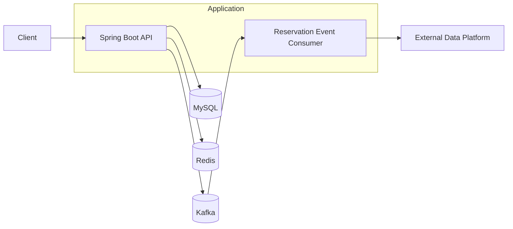

# Concert Ticketing Server

[](https://github.com/w00lam/concert-ticketing-server/actions/workflows/ci.yml)

콘서트 티켓팅 도메인의 좌석 선점, 결제 멱등성, 대기열, 이벤트 후속 처리를 다루는 Spring Boot 서버입니다. 단순 CRUD보다 **동시성 제어**, **트랜잭션 정합성**, **Redis/Kafka 기반 인프라 연동**, **테스트 가능한 구조**에 초점을 맞췄습니다.

## Technical Overview

이 프로젝트는 티켓 오픈처럼 짧은 시간에 요청이 몰리는 상황을 가정합니다. 핵심 목표는 같은 좌석이 중복 예약되거나, 같은 예약이 중복 결제되거나, 롤백된 예약 이벤트가 외부 시스템에 전달되는 일을 막는 것입니다.

| Problem | Solution | Verification |
| --- | --- | --- |
| 동일 좌석 중복 예약 | Redis 분산락, 활성 예약 조건 검사 | 좌석 동시 예약 통합 테스트 |
| 동일 예약 중복 결제 | 예약 단위 결제 멱등성, 결제 요청 조건 비교 | 결제 멱등성/동시성 통합 테스트 |
| 포인트 동시 차감 | JPA 낙관적 락 기반 잔액 정합성 보호 | 포인트 차감 동시성 통합 테스트 |
| 대기열 순서 보장 | Redis Sorted Set, `ZPOPMIN` 기반 dequeue | Redis 대기열 통합 테스트 |
| 결제 후 외부 후속 처리 | `AFTER_COMMIT` 이벤트, Kafka Producer/Consumer | Embedded Kafka 통합 테스트 |
| 조회 API 성능/결합도 | 엔티티 로딩 대신 조회 전용 Projection | 조회 유스케이스 단위 테스트 |

## Key Features

- 콘서트 날짜/좌석 조회
- 좌석 임시 예약 및 예약 확정
- 예약 취소
- 포인트 충전/조회/차감
- 결제 생성 및 중복 결제 방지
- Redis 기반 대기열 순번 관리
- 예약 확정 이벤트 기반 Kafka 후속 처리
- 공통 API 응답과 ErrorCode 기반 예외 응답

## Architecture



패키지는 기능 단위로 나누고, 각 기능 내부를 application/domain/infrastructure/presentation 계층으로 분리했습니다.

```text
kr.hhplus.be.server
├── common
├── concert
├── payment
├── point
├── reservation
├── tokenqueue
└── user
```

주요 경계:

- `application.port.in`: 유스케이스 입력 포트
- `application.port.out`: 저장소/외부 시스템 출력 포트
- `application.service`: 트랜잭션 흐름과 유스케이스 조율
- `domain`: 엔티티, 도메인 서비스, 정책
- `infrastructure`: JPA, Redis, Kafka 어댑터
- `presentation`: Controller, Request/Response DTO

## Consistency Strategy

### Seat Reservation

- 좌석 예약 요청은 Redis 분산락을 통해 같은 좌석에 대한 동시 진입을 제어합니다.
- 예약 저장 전 활성 예약 조건을 검사해 중복 예약을 방어합니다.
- 락 해제는 Redis Lua script 기반 compare-and-delete 방식으로 처리해 다른 요청의 락을 잘못 지우지 않게 했습니다.

### Payment

- 결제는 예약 ID 기준으로 1건만 생성됩니다.
- 같은 예약에 같은 금액/수단으로 재요청하면 기존 결제를 반환합니다.
- 같은 예약에 다른 금액/수단으로 재요청하면 `PAYMENT_ALREADY_PROCESSED`로 거절합니다.
- 포인트 차감, 예약 확정, 결제 생성을 하나의 트랜잭션 흐름 안에서 처리합니다.

### Event Processing

- 예약 확정 이벤트는 트랜잭션 커밋 이후 발행됩니다.
- Kafka Producer/Consumer는 포트와 어댑터로 분리했습니다.
- Embedded Kafka 통합 테스트에서 예약 ID와 콘서트 ID가 담긴 이벤트가 Consumer까지 전달되는지 검증합니다.

### Queue

- 대기열은 Redis Sorted Set으로 관리합니다.
- score는 진입 시각이고, rank는 대기 순번으로 사용합니다.
- dequeue는 `ZPOPMIN`으로 첫 사용자 조회와 제거를 원자적으로 처리합니다.

## Tech Stack

- Java 17
- Spring Boot 3.4
- Spring Data JPA
- MySQL
- Redis
- Kafka
- Gradle Kotlin DSL
- JUnit 5, Mockito, AssertJ, Awaitility
- Testcontainers, Embedded Kafka

## Test Strategy

기본 단위 테스트와 인프라 통합 테스트를 분리했습니다.

| Layer | Scope | Command |
| --- | --- | --- |
| Unit | 도메인 규칙, 유스케이스 분기, 예외 코드 | `./gradlew test` |
| Integration | MySQL/Redis/Kafka 연동 | `./gradlew integrationTest` |
| Concurrency | 좌석 예약, 결제, 포인트 차감 동시성 | `./gradlew integrationTest` |

대표 검증:

- 동일 좌석 동시 예약 시 임시 배정은 1건만 성공
- 동일 예약 동시 결제 시 결제는 1건만 생성
- 포인트 동시 차감 시 낙관적 락으로 잔액 정합성 유지
- Redis 대기열은 순번 부여 후 첫 사용자를 원자적으로 제거
- 결제 완료 후 예약 확정 이벤트가 Kafka Consumer까지 전달

## Running Locally

로컬 인프라를 먼저 실행합니다.

```bash
docker compose up -d
```

애플리케이션 실행:

```bash
./gradlew bootRun
```

테스트:

```bash
./gradlew test
./gradlew integrationTest
```

통합 테스트는 Docker/Testcontainers 환경이 필요합니다.

## API Docs

- Swagger UI: `http://localhost:8080/swagger-ui.html`
- OpenAPI JSON: `http://localhost:8080/v3/api-docs`
- Health: `http://localhost:8080/actuator/health`
- Readiness: `http://localhost:8080/actuator/health/readiness`

## Documentation

- [Refactoring Notes](docs/portfolio-refactoring-notes.md)
- [API Response Policy](docs/api-response-policy.md)
- [ERD](docs/erd.md)
- [Reservation Scenario](docs/ssd.md)
- [Infrastructure](docs/infra.md)
- [Performance Analysis](docs/performance-analysis.md)
- [Load Test Plan](docs/load-test-plan.md)
- [Local Development Guide](docs/local-dev-guide.md)
- [Database Schema Migrations](docs/database-schema-migrations.md)
- [OpenAPI Spec](docs/openapi.yml)

## Refactoring Highlights

- 결제 유스케이스 내부 책임을 `PaymentProcessor`로 분리
- 예약 생성/확정/취소 흐름의 도메인 메시지와 정책 정리
- 조회 API에 Result Projection 도입
- 동시성 테스트 공통 유틸 추출
- 통합 테스트 fixture helper 정리
- Kafka/Redis 통합 테스트의 검증 의도 강화
- 포트폴리오 설명용 리팩토링 노트 추가
