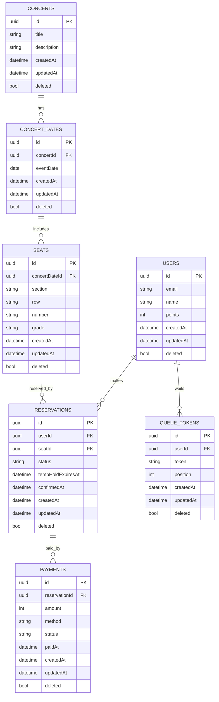

---

# 1. Overview

이 문서는 콘서트 예약 플랫폼의 핵심 도메인 모델을 설명합니다.
ERD, 스키마 제약, FK 정책, 인덱스 전략, 예약 상태 전환 규칙을 포함하여
운영 환경에서 데이터 무결성과 확장성을 보장하기 위한 기준을 제공합니다.

---

# 2. ERD Diagram (Mermaid)


---

# 3. Table Specification
### USERS
| 필드                   | 타입           | 제약               |
| -------------------- | ------------ | ---------------- |
| id                   | UUID         | PK               |
| email                | VARCHAR(255) | UNIQUE, NOT NULL |
| name                 | VARCHAR(100) | NOT NULL         |
| points               | INT          | DEFAULT 0        |
| createdAt, updatedAt | DATETIME     | NOT NULL         |
| deleted              | BOOLEAN      | soft delete      |


**인덱스**
- `email UNIQUE`
- `(deleted, email)` partial filtering 고려

**포인트 관련**
- `points` 필드는 결제/충전에 사용됨
- 트랜잭션 적용 필수 (충전/사용 시 race condition 방지)

### CONCERTS
| 필드                   | 타입           | 제약          |
| -------------------- | ------------ | ----------- |
| id                   | UUID         | PK          |
| title                | VARCHAR(255) | NOT NULL    |
| description          | TEXT         | NULL        |
| createdAt, updatedAt | DATETIME     | NOT NULL    |
| deleted              | BOOLEAN      | soft delete |

### CONCERT_DATES
| 필드                   | 타입       | 제약                |
| -------------------- | -------- | ----------------- |
| id                   | UUID     | PK                |
| concertId            | UUID     | FK → CONCERTS(id) |
| eventDate            | DATE     | NOT NULL          |
| createdAt, updatedAt | DATETIME | NOT NULL          |
| deleted              | BOOLEAN  |                   |

**FK 정책**
- `ON DELETE CASCADE` (콘서트 삭제 시 날짜 전체 삭제)
- `ON UPDATE CASCADE`

### SEATS
| 필드                   | 타입          | 제약       |
| -------------------- | ----------- | -------- |
| id                   | UUID        | PK       |
| concertDateId        | UUID        | FK       |
| section              | VARCHAR(20) | NOT NULL |
| row                  | VARCHAR(5)  | NOT NULL |
| number               | VARCHAR(5)  | NOT NULL |
| grade                | VARCHAR(20) | NOT NULL |
| createdAt, updatedAt | DATETIME    |          |
| deleted              | BOOLEAN     |          |


**UNIQUE 제약**
- `(concertDateId, section, row, number)` → 동일 날짜 동일 좌석 중복 금지

**추천 인덱스**
- `concertDateId`
- `(concertDateId, section)`
- `(concertDateId, section, row)` (좌석 조회 최적화)

### RESERVATIONS
| 필드                   | 타입                                                 | 제약       |
| -------------------- | -------------------------------------------------- | -------- |
| id                   | UUID                                               | PK       |
| userId               | UUID                                               | FK       |
| seatId               | UUID                                               | FK       |
| status               | ENUM('TEMP_HOLD','CONFIRMED','CANCELED','EXPIRED') | NOT NULL |
| tempHoldExpiresAt    | DATETIME                                           | NULL     |
| confirmedAt          | DATETIME                                           | NULL     |
| createdAt, updatedAt | DATETIME                                           |          |
| deleted              | BOOLEAN                                            |          |


중요 제약 – 좌석 중복 **예약 방지**

⛔ **(seatId, status) UNIQUE** where status IN ('TEMP_HOLD','CONFIRMED')

→ 하나의 seatId는 동시에 1명만 잡을 수 있음

→ CANCELED, EXPIRED는 중복 허용

**FK 정책**
- `ON DELETE RESTRICT` (좌석 삭제 시 예약 카스케이드 방지)
- `ON UPDATE CASCADE`

**추천 인덱스**
- `(userId)`
- `(seatId, status)`
- `(status, tempHoldExpiresAt)` → 만료 처리 배치 최적화

### PAYMENTS
| 필드                   | 타입                                         | 제약       |
| -------------------- | ------------------------------------------ | -------- |
| id                   | UUID                                       | PK       |
| reservationId        | UUID                                       | FK       |
| amount               | INT                                        | NOT NULL |
| method               | VARCHAR(20)                                | NOT NULL |
| status               | ENUM('PENDING','PAID','FAILED','CANCELED') | NOT NULL |
| paidAt               | DATETIME                                   | NULL     |
| createdAt, updatedAt | DATETIME                                   |          |
| deleted              | BOOLEAN                                    |          |


**FK 정책**
- `ON DELETE RESTRICT` (예약 삭제를 결제로 제한)

**추천 인덱스**
- `(reservationId)`
- `(status)`

### QUEUE_TOKENS
| 필드                   | 타입           | 제약               |
| -------------------- | ------------ | ---------------- |
| id                   | UUID         | PK               |
| userId               | UUID         | FK               |
| token                | VARCHAR(255) | UNIQUE, NOT NULL |
| position             | INT          | NOT NULL         |
| createdAt, updatedAt | DATETIME     |                  |
| deleted              | BOOLEAN      |                  |

---

# 4. Reservation Status Lifecycle

예약 프로세스는 아래 규칙을 따라 진행됩니다.
```scss
TEMP_HOLD → CONFIRMED → (PAID) → 완료

TEMP_HOLD → EXPIRED (만료)
TEMP_HOLD → CANCELED (사용자 취소)
CONFIRMED → CANCELED (결제 실패)
```

---

# 5. Transaction Boundary (중요)
### 5.1 TEMP_HOLD 생성 (좌석 홀딩)
**트랜잭션 필수**
1. seatId 중복 체크
2. reservation 생성(status=TEMP_HOLD)
3. 임시홀드 만료시간 기록

### 5.2 CONFIRM 단계
(결제 전 확정)
- TEMP_HOLD → CONFIRMED
- 동시에 seatId의 TEMP_HOLD 중복 존재 제거 검사

### 5.3 결제 완료
- PAYMENTS insert
- RESERVATIONS.status = CONFIRMED 유지
- 포인트 차감

### 5.4 만료 처리 배치
- `tempHoldExpiresAt < now`
- status = EXPIRED 로 변경

---

# 6. Composite Index Recommendations
### For Seats Lookup
사용자 좌석 리스트 조회:
```sql
SELECT *
FROM seats
WHERE concertDateId = ?
ORDER BY section, row, number;
```
👉 인덱스 권장
- `(concertDateId, section, row, number)`

### For Reservation Hold/Check
TEMP_HOLD 중복 확인:
```sql
SELECT 1
FROM reservations
WHERE seatId = ?
  AND status IN ('TEMP_HOLD','CONFIRMED')
LIMIT 1;
```
👉 인덱스 권장
- `(seatId, status)`

### For Expiration Batch
```sql
SELECT id
FROM reservations
WHERE status = 'TEMP_HOLD'
  AND tempHoldExpiresAt < NOW();
```
👉 인덱스 권장
- `(status, tempHoldExpiresAt)`

---

# 7. Deletion Policy
### Soft Delete 적용 테이블
- USERS
- CONCERTS
- CONCERT_DATES
- SEATS
- RESERVATIONS
- PAYMENTS
- QUEUE_TOKENS

### FK 삭제 정책
| 테이블                      | on delete | 이유                  |
| ------------------------ | --------- | ------------------- |
| CONCERT_DATES → CONCERTS | CASCADE   | 상위 공연 지우면 날짜도 제거    |
| SEATS → CONCERT_DATES    | CASCADE   | 날짜 삭제 시 좌석도 함께 삭제   |
| RESERVATIONS → SEATS     | RESTRICT  | 예약된 좌석은 승인이므로 삭제 제한 |
| PAYMENTS → RESERVATIONS  | RESTRICT  | 결제 내역 보호            |

---

# 8. Points Transaction Boundary

### 8.1 포인트 조회
- 단순 조회: `USERS.points` 반환
- 예외: 사용자 없음 → 404

### 8.2 포인트 충전

**트랜잭션 필수**
1. 사용자 존재 확인
2. `points = points + amount` 업데이트
3. 새 잔액 반환

**예시 SQL**
```sql
UPDATE users
SET points = points + :amount, updatedAt = NOW()
WHERE id = :userId
RETURNING points;
```

### 8.3 포인트 사용
- 예약 결제 시 TEMP_HOLD → CONFIRMED 단계에서 포인트 차감
- 사용량 > 잔액 → 결제 실패

**예시 SQL**
```sql
UPDATE users
SET points = points - :amount, updatedAt = NOW()
WHERE id = :userId
  AND points >= :amount
RETURNING points;
```

---

# 향후 고려 추가 요소
- 좌석 가격 정책 테이블(공연 날짜마다 price rule 적용)
- 배치 서버의 만료 처리 interval 정책
- 좌석 등급/구역 모델링 확장
- 대기열 Redis 기반 분산 락 설계

---
