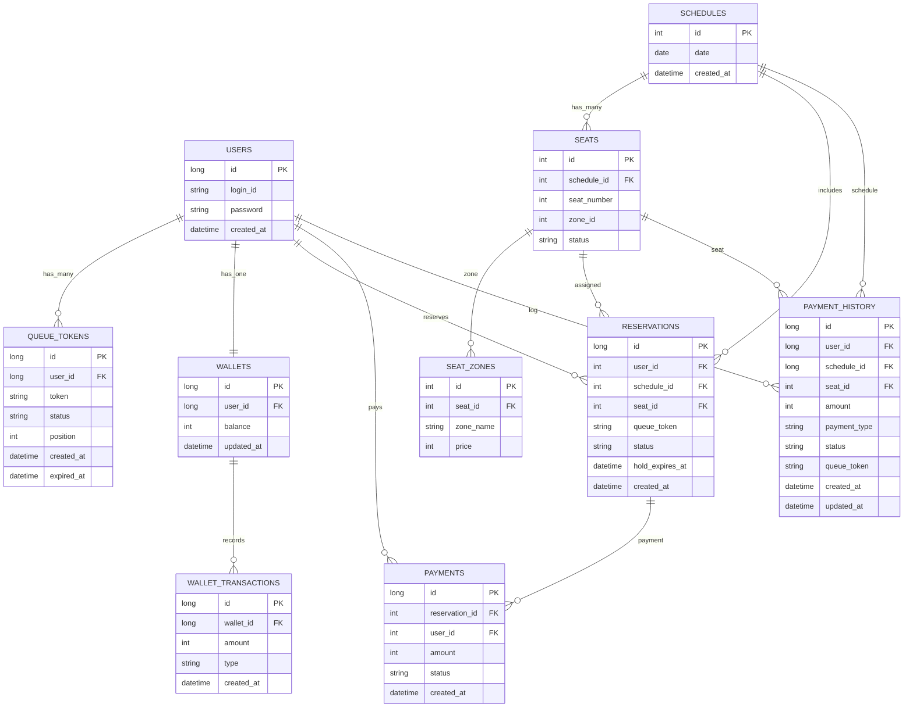

```mermaid
erDiagram
    USERS {
        long id PK
        string login_id
        string password
        datetime created_at
    }

    QUEUE_TOKENS {
        long id PK
        long user_id FK
        string token
        string status
        int position
        datetime created_at
        datetime expired_at
    }

    USERS ||--o{ QUEUE_TOKENS : has_many

    WALLETS {
        long id PK
        long user_id FK
        int balance
        datetime updated_at
    }

    USERS ||--|| WALLETS : has_one

    WALLET_TRANSACTIONS {
        long id PK
        long wallet_id FK
        int amount
        string type
        datetime created_at
    }

    WALLETS ||--o{ WALLET_TRANSACTIONS : records

    SCHEDULES {
        int id PK
        date date
        datetime created_at
    }

    SEATS {
        int id PK
        int schedule_id FK
        int seat_number
        int zone_id
        string status
    }

    SCHEDULES ||--o{ SEATS : has_many

    SEAT_ZONES {
        int id PK
        int seat_id FK
        string zone_name
        int price
    }

    SEATS ||--o{ SEAT_ZONES : zone

    RESERVATIONS {
        long id PK
        int user_id FK
        int schedule_id FK
        int seat_id FK
        string queue_token
        string status
        datetime hold_expires_at
        datetime created_at
    }

    USERS ||--o{ RESERVATIONS : reserves
    SCHEDULES ||--o{ RESERVATIONS : includes
    SEATS ||--o{ RESERVATIONS : assigned

    PAYMENTS {
        long id PK
        int reservation_id FK
        int user_id FK
        int amount
        string status
        datetime created_at
    }

    RESERVATIONS ||--o{ PAYMENTS : payment
    USERS ||--o{ PAYMENTS : pays

    PAYMENT_HISTORY {
        long id PK
        long user_id FK
        long schedule_id FK
        int seat_id FK
        int amount
        string payment_type
        string status
        string queue_token
        datetime created_at
        datetime updated_at
    }

    USERS ||--o{ PAYMENT_HISTORY : log
    SCHEDULES ||--o{ PAYMENT_HISTORY : schedule
    SEATS ||--o{ PAYMENT_HISTORY : seat
```
