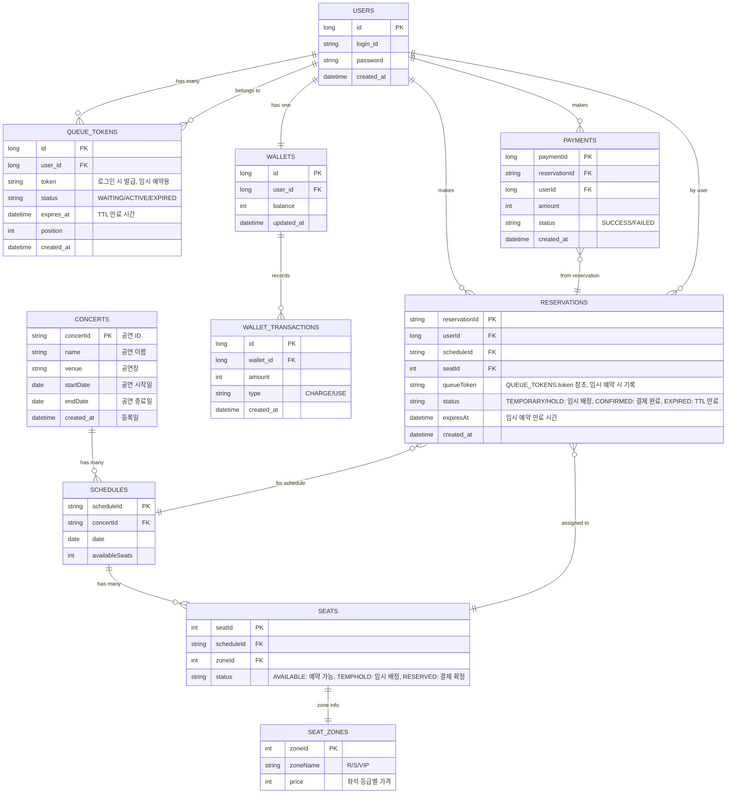

# 콘서트 예약 서비스 - DB & ERD

## 체크리스트

- [ ]  엔터티 나열
- [ ]  각 엔터티 주요 필드와 제약(필수/유니크/길이)
- [ ]  관계 정의(1:N, N:M)와 삭제 정책(소프트/하드)
- [ ]  조회 성능용 인덱스 후보 지정

---

## 1. 테이블 설명과 역할

| 테이블명 | 역할 |
|----------|------|
| `CONCERTS` | 공연 정보 (이름, 공연장, 기간) |
| `SCHEDULES` | 공연 날짜별 스케줄 |
| `SEATS` | 좌석, 상태 관리 (AVAILABLE/TEMPHOLD/RESERVED) |
| `SEAT_ZONES` | 좌석 등급(zone)과 가격 |
| `USERS` | 유저 정보 |
| `QUEUE_TOKENS` | 로그인 후 발급되는 임시 예약용 토큰 |
| `WALLETS` | 유저 포인트 정보 |
| `WALLET_TRANSACTIONS` | 충전/사용 기록 |
| `RESERVATIONS` | 임시 예약/확정 예약 기록, TTL 관리 |
| `PAYMENTS` | 결제 트랜잭션 기록 |

---

## 2. 컬럼 설명

- **토큰 관련**
  - `QUEUE_TOKENS.token` ↔ `RESERVATIONS.queueToken`: 동일 값 참조
  - 상태 필드 의미
    - `QUEUE_TOKENS.status`: `WAITING` / `ACTIVE` / `EXPIRED`
    - `RESERVATIONS.status`: `TEMPORARY/HOLD` / `CONFIRMED` / `EXPIRED`

- **좌석 상태**
  - `SEATS.status`: `AVAILABLE` → `TEMPHOLD` → `RESERVED` → TTL 만료 시 `AVAILABLE`로 복귀

- **TTL**
  - 임시 예약 TTL: 5분
  - `RESERVATIONS.expiresAt`과 `QUEUE_TOKENS.expires_at` 컬럼으로 관리

---

## 3. ERD

---

## 4. 동시성 / 제약 사항

- 임시 예약 중 동일 좌석에 대한 충돌 처리 `409 CONFLICT`
  
- TTL 만료 시 상태 자동 갱신
  
- 결제 성공 시
    - `RESERVATIONS.status` → `CONFIRMED`
    - `SEATS.status` → `RESERVED`
      
- 결제 실패 또는 TTL 만료 시 상태 롤백
  
---

## 5. 추가 가능 사항

- 좌석/스케줄별 **총 좌석 수, 남은 좌석 수** 계산 방법
  
- 예약 내역/결제 내역 조회 시 `queueToken` 참조
  
- DB 인덱스 제안
    - `USERS.login_id`
    - `QUEUE_TOKENS.token`
    - `SEATS.scheduleId + seatId`
    - `RESERVATIONS.queueToken`, `RESERVATIONS.seatId`

- 추후 확장
    - 콘서트별 티켓 할인 정책
    - 프로모션 적용
    - 좌석 구간별 가변 가격
 
---
