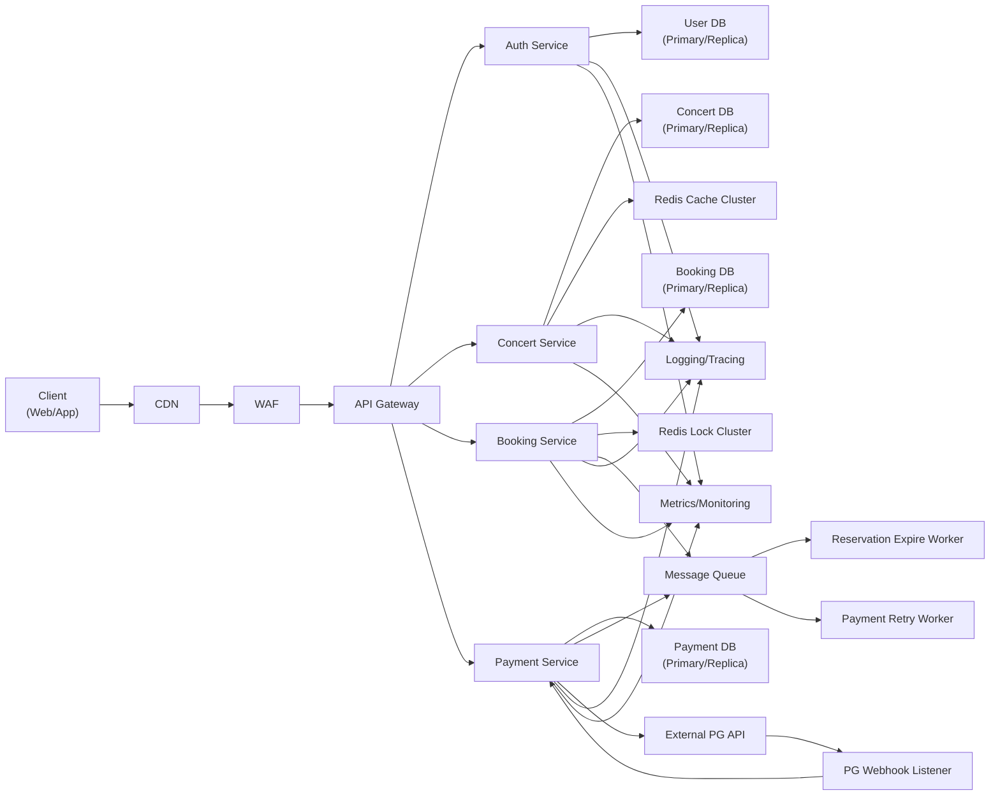

# 인프라구성도

## 1. 개요 (Overview)

본 문서는 **콘서트 예약 서비스**의 전체 인프라 구성을 기술한다.
해당 시스템은 다음과 같은 특징을 갖는다:

- 높은 트래픽과 동시성 경쟁을 고려한 구조
- QueueToken 기반의 사용자 접근 제어
- 좌석 임시 예약(TTL 5분)
- Redis 기반의 분산락(Distributed Lock)
- Wallet 포인트 결제 및 PG 연동
- 예약/결제 트랜잭션 일관성 보장
- 확장 가능한 MSA(Service 별 확장) 구조

본 문서에서는 **아키텍처 구성**, **서비스 컴포넌트 설명**, **주요 데이터 흐름**, **장애 대응 전략**, **확장성 고려사항**을 포함한다.

---

## 2. 전체 아키텍처 구성도 (Architecture Diagram)

---

## 3. 서비스 컴포넌트 설명

| 서비스                 | 역할                                   |
| ------------------- | ------------------------------------ |
| Auth Service        | 로그인, JWT 발급, QueueToken 발급           |
| Concert Service     | 콘서트 정보, 스케줄, 좌석 조회, 좌석 상태 관리         |
| Booking Service     | 좌석 임시 예약, TTL 관리, Redis Lock         |
| Payment Service     | 포인트 결제, PG 연동, 결제 상태 관리              |
| User DB             | 사용자 정보 저장 (Primary/Replica)          |
| Concert DB          | 콘서트/스케줄/좌석 정보 저장 (Primary/Replica)   |
| Booking DB          | 예약/임시 배정 정보 저장 (Primary/Replica)     |
| Payment DB          | 결제 내역, 포인트 트랜잭션 저장 (Primary/Replica) |
| Redis Lock Cluster  | 동시성 제어, TTL 관리                       |
| Redis Cache Cluster | 좌석/콘서트 조회 캐싱                         |
| Message Queue       | 예약 만료, 결제 재시도 등 비동기 작업 처리            |
| External PG API     | 결제 연동, PG Webhook 처리                 |
| Logging/Tracing     | 서비스 호출 로깅, 분산 트레이싱                   |
| Metrics/Monitoring  | 성능/리소스 모니터링                          |

---

## 4. 주요 데이터 흐름

1. 사용자가 웹/앱에서 로그인 → Auth Service → QueueToken 발급
2. 콘서트 조회 → Concert Service → Redis 캐시 확인 → DB 조회
3. 좌석 임시 예약 → Booking Service → Redis Lock → 예약 DB 기록 → Message Queue에 TTL 등록
4. TTL 만료 시 Worker가 Message Queue에서 예약 해제
5. 결제 요청 → Payment Service → Wallet DB 차감 → PG API 연동 → 결제 결과 저장 → Message Queue 재시도 처리 가능

---

## 5. 장애 대응 전략

- Redis Lock Fail → BookingService에서 409 Conflict 반환
- DB Replica 읽기 실패 → Primary DB로 Fallback
- PG API 실패 → Payment Retry Worker 재시도
- TTL 만료 처리 지연 → 예약 해제 Worker 재시도

---

## 6. 확장성 고려사항

- 각 서비스별 MSA 구조로 독립 스케일링 가능
- Redis Cluster로 동시성 및 캐시 성능 확장
- DB Primary/Replica 구조로 읽기/쓰기 분리
- Message Queue로 비동기 작업 분리, Worker 확장 가능
- Observability 통합으로 서비스 모니터링 및 알람 가능

---
