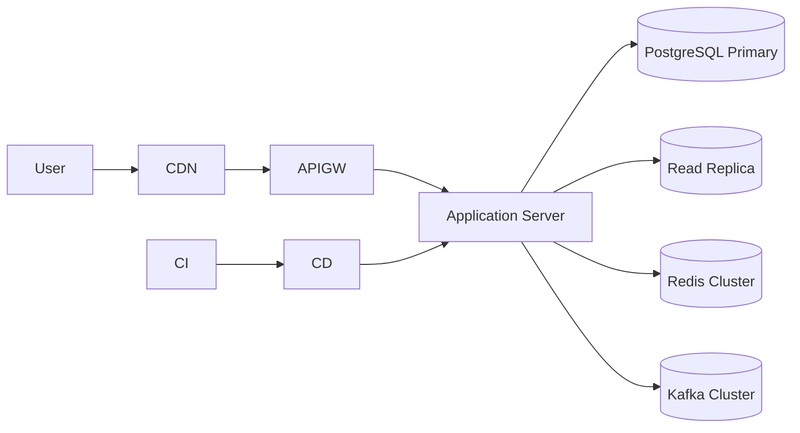

---

# 1. Overview

본 문서는 콘서트 예약 시스템의 전체 인프라 구조, 배포 파이프라인, 구성요소(H/A, 선택 이유 포함), 모니터링·알람 지표, 운영 리스크 대응 전략을 기술합니다.

---

# 2. 시스템 아키텍처 개요

---

# 3. 배포 흐름 (CI/CD Pipeline)

### 전체 단계

### 1) Build
- GitHub Actions
    - 코드 정적 분석
    - 테스트 수행
    - **Docker 이미지 빌드 → Registry Push**
- *(선정 이유: GitHub Actions는 Repo와 자연 통합되어 운영 비용이 낮음)*

### 2) Staging 배포
- 최신 이미지 자동 배포
- Health Check & Smoke Test 실행
- 문제 발생 시 자동 알림

### 3) Production 배포
- 매뉴얼 승인 후 Blue/Green 방식으로 배포
- Canary 옵션(10% → 30% → 전량) 선택 가능
- Issue 발생 시 **즉시 롤백 (이전 Stable Image)**

### 4) Rollback 전략
- Blue/Green 상태 유지
- Kafka consumer offset freeze 가능
- DB migration은 backward-compatible 전략 적용

### 선정 이유 요약
- **Blue/Gree**: 예약 시스템 특성상 무중단 배포가 매우 중요
- **Canary**: 트래픽 일부만 보내 문제 조기 감지
- **Staging 동일성**: 실제 예약 API와 동일한 환경에서 검증 필요

---

# 4. Database (PostgreSQL)

### 구성 요소
- Primary DB
    - 쓰기/트랜잭션 담당
- Replica DB
    - 조회 트래픽 분산
    - 콘서트/날짜/좌석 조회 같은 고QPS API 처리

### Replication Mode
- Physical Streaming Replication
- 장애 시 Replica → Primary 자동 승격(Promotion)

### 삭제/갱신 정책
- Soft Delete(`deletedAt`) 기반
- FK는 기본 `ON UPDATE CASCADE`, `ON DELETE RESTRICT`
- 예약/좌석 등 핵심 테이블은 CASCADE 최소화

### 스키마 제약
- Seat: `(concertDateId, row, col)` UNIQUE
- Reservation: `(seatId)` UNIQUE (seat double-booking 방지)
- 모든 id는 UUID (충돌 방지 및 분산 환경에서 유리)

### 선정 이유
- 강력한 트랜잭션
- 다양한 인덱싱과 복제 기능
- Seat/Reservation처럼 경쟁 조건이 많은 구조에 안정적

### 알람/모니터링 지표
- **Replication Lag**
- Deadlock 발생률
- Long-running Query
- Connection Pool 사용률

---

# 5. Redis (Cluster)

### 주요 역할
- 분산 락(좌석 임시 배정 Lock)
- **Seat Pending Assignment 저장** (TTL 기반 임시 점유)
- **대기열 토큰 저장**
- 일부 API rate-limit 보조 용도

### HA 구성
- Redis Cluster (3 Master, 3 Replica)
- 자동 Failover 지원

### 분산 락 사용 이유
- 초고속 처리 + Lua Script 기반 원자적 연산
- 다중 인스턴스 환경에서 Seat 경쟁 조건을 제어하기 위해 필수

### 알람/모니터링 지표
- Latency spike
- Key Expiration 폭증
- Failover 이벤트
- Memory fragmentation

### 선정 이유
- TTL + Lock + Queue Token 관리가 매우 빠르고 안정적
- DB 로딩 없이 초고속 경쟁 제어 가능

---

# 6. Kafka (Message Queue)

### 사용 영역
- 결제 완료 후 예약 확정 이벤트 처리
- 포인트 충전 기록 저장
- 알림/이벤트 후처리 비동기화

 ### 운영 전략
 - Consumer Group 기반 수평 확장
 - Offset 관리로 재처리 및 장애 대응
 - DLQ 적용 가능

### 선정 이유
- 높은 처리량
- 내구성 & 재처리 용이
- 트래픽 피크 이후 자연스러운 이벤트 소화 가능

### 알람/모니터링 지표
- ConsumerLag
- Topic 적재량 증가
- 재시도(Errored) Message 증가

---

# 7. Application Server (Spring Boot)

### 주요 특징
- Stateless 구조 → 자동 확장(HPA) 적용 가능
- FeignClient 기반 외부 결제/포인트 연동
- RateLimiter + CircuitBreaker(Fallback) 적용

### Scaling 정책
- CPU > 60%
- Response Latency(P95) 증가
- Queue Token 발급 API QPS 급증 시 자동 확장

### 선정 이유
- Spring Boot 기반 생태계가 관찰성/운영 도구와 잘 맞음
- MSA로의 확장이 자연스러움

---

# 8. API Gateway

### 역할
- 라우팅
- 인증/인가
- Rate Limit
- 공통 로깅/트레이싱

### 선정 이유
- 단일 진입점에서 트래픽 제어
- 공격 방어 및 Abuse 방지

---

# 9. Secrets & Config 관리

- Vault/KMS 기반 암호화
- 환경 변수 + GitOps 기반 ConfigMap
- Secret rotation 가능

---

# 10. Observability (모니터링 & 알람)

### APM
- Application latency (P95/P99)
- API 에러율
- TPS
- Reservation 실패 패턴 모니터링

### Logging
- JSON 구조 로그
- Correlation-ID 기반 Trace

### Metrics Dashboard (Prometheus + Grafana)
- Redis latency
- Kafka lag
- DB replication lag
- Lock Waits
- Slow Query Trends

### Alerting
- Redis failover 발생
- Kafka consumer lag > threshold
- DB replication lag > threshold
- 예약 실패율 증가
- 대기열 토큰 처리 지연

---

# 11. Network & Security

- VPC (public/private subnet)
- Redis/DB/Kafka는 Private subnet
- WAF + Bot detection
- API Throttling (특히 좌석 예약, 대기열 진입)

---

# 12. Infra as Code

- Terraform 기반 전체 IaC
- Helm으로 앱 배포 템플릿 관리
- GitOps 스타일

---

# 13. Appendix

### 트래픽 패턴 기반 최적화
- 조회 트래픽은 대부분 Replica 또는 Redis 캐싱으로 해결
- 예약/결제는 강한 트랜잭션 요구 → Primary + Redis 분산락 조합

### 장애 시나리오 대응
| 장애             | 대응 전략                            |
| -------------- | -------------------------------- |
| Redis Failover | Pending Seat TTL 보존, Lock 자동 재확립 |
| DB Primary 장애  | Replica Auto-Promotion           |
| Kafka Lag 증가   | Consumer scale-out               |
| Deployment 문제  | Blue/Green 롤백                    |

---
