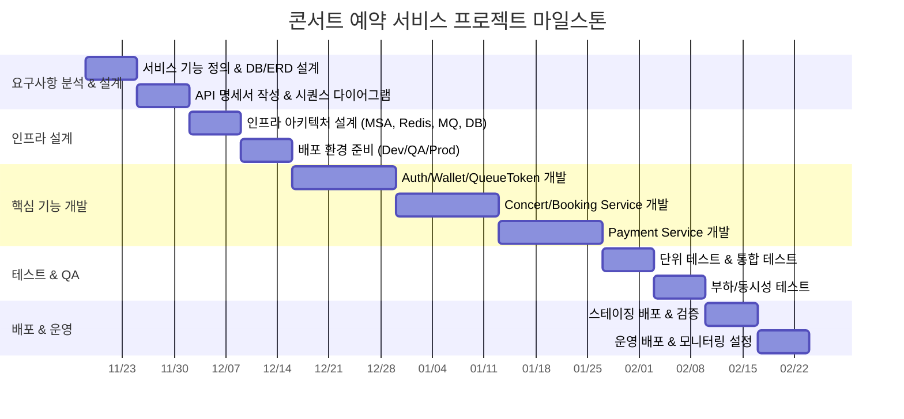

# 마일 스톤

---

```mermaid
gantt
    title 콘서트 예약 서비스 프로젝트 마일스톤
    dateFormat  YYYY-MM-DD
    axisFormat  %m/%d

    section 요구사항 분석 & 설계
    서비스 기능 정의 & DB/ERD 설계 :a1, 2025-11-18, 7d
    API 명세서 작성 & 시퀀스 다이어그램 :a2, after a1, 7d

    section 인프라 설계
    인프라 아키텍처 설계 (MSA, Redis, MQ, DB) :b1, after a2, 7d
    배포 환경 준비 (Dev/QA/Prod) :b2, after b1, 7d

    section 핵심 기능 개발
    Auth/Wallet/QueueToken 개발 :c1, after b2, 14d
    Concert/Booking Service 개발 :c2, after c1, 14d
    Payment Service 개발 :c3, after c2, 14d

    section 테스트 & QA
    단위 테스트 & 통합 테스트 :d1, after c3, 7d
    부하/동시성 테스트 :d2, after d1, 7d

    section 배포 & 운영
    스테이징 배포 & 검증 :e1, after d2, 7d
    운영 배포 & 모니터링 설정 :e2, after e1, 7d
```

---
