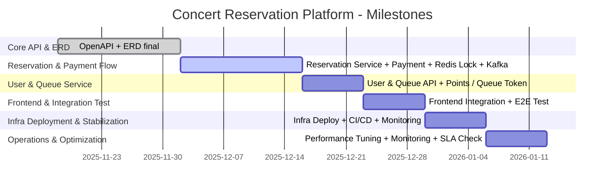

---

# 1. 🎯 Overview

본 문서는 **콘서트 예약 플랫폼 개발 및 운영**의 주요 마일스톤을 정리합니다.

API, ERD, INFRA, SSD를 기반으로 기능, 배포, 테스트, 운영 단계를 포함했습니다.

---

# 2. 🗓️ Week 1~2 – Core API & ERD 확정

**목표**:
- OpenAPI 기반 콘서트 조회/날짜/좌석 API 정의
- ERD 확정 및 DB 스키마 설계
- UUID 기반 ID 정책, 제약 조건(NOT NULL, UNIQUE, FK) 명시
- 
**주요 작업**:
- `openapi.yml` 검토 및 수정
- `erd.md` 최종 확정
- Seat/Reservation 상태 모델 정의
- DB 인덱스 및 트랜잭션 경계 문서화

**검증/완료 기준**:
- Postman/Swagger에서 CRUD 동작 확인
- DB 스키마 생성 가능
- 좌석 예약 중복 방지 로직 검증

---

# 3. 🗓️ Week 3~4 – Reservation & Payment Flow 구현

**목표**:
- 좌석 임시 배정(PENDING) 및 예약 확정(COMPLETE) 구현
- 결제 API 연동 및 MQ 기반 후처리 설계
- Redis 기반 분산 락, TTL 임시 할당 적용

**주요 작업**:
- Reservation Service 개발 (좌석 예약, 상태 전환)
- Payment Service 개발 (PG 연동, Kafka 이벤트 발행)
- Redis Seat Hold + Queue Token 구현
- SSD 기반 시퀀스 다이어그램 검증

**검증/완료 기준**:
- 임시 배정 → 결제 성공 시 예약 확정 흐름 정상 동작
- TTL 만료 시 자동 PENDING 해제
- Kafka 이벤트 처리 정상

---

# 4. 🗓️ Week 5 – User & Queue 서비스 구현

**목표**:
-User Service (회원, 포인트 충전/조회)
Queue Service (대기열 토큰 발급, 순번 관리)
Redis Sorted Set 기반 대기열 관리

**주요 작업**:
- `/users/points` API 구현
- `/queue/token` API 구현
- Queue 순번 조회 API 구현
- 대기열 TTL 및 동시성 테스트

**검증/완료 기준**:
- 포인트 충전/조회 정상 동작
- Queue Token 발급 + 순번 조회 정확
- 경쟁 상황에서 Seat Lock과 충돌 없이 처리 가능

---

# 5. 🗓️ Week 6 – Frontend 연동 & 통합 테스트

**목표**:
- 프론트엔드 콘서트/날짜/좌석 UI 연동
- 전체 예약/결제 플로우 통합 테스트
- 임시 좌석 할당, 만료, 결제 실패/성공 시 상태 반영 확인

**주요 작업**:
- API 통합
- 좌석 임시 배정 시 TTL 테스트
- 결제 실패 시 롤백 검증
- SSD 기반 End-to-End 시퀀스 점검

**검증/완료 기준**:
- 모든 시나리오 정상 수행
- Seat 상태 동기화 문제 없음
- Frontend와 Backend 간 정상 연동

---

# 6. 🗓️ Week 7 – Infra 배포 & 안정화

**목표**:
- Infra 배포 (EKS/K8s, Redis Cluster, PostgreSQL Primary/Replica, Kafka)
- CI/CD 파이프라인 적용 (Staging → Production, Blue/Green or Canary)
- 모니터링/알람 세팅

**주요 작업**:
- `infra.md` 기반 배포 스크립트 완성
- Redis HA 구성, Failover 테스트
- DB Replica 승격 테스트
- Prometheus/Grafana/Alert 세팅

**검증/완료 기준**:
- Staging → Production 배포 성공
- 장애 시 Rollback 및 Failover 정상 동작
- 운영 알람 정상 수신

---

# 7. 🗓️ Week 8 – 운영/모니터링 & 최적화

**목표**:
- 실시간 트래픽 감시, 예약 경쟁 상황 대응
- 성능/지연 모니터링, Redis/Kafka/DB 튜닝
- SSD 기반 운영 시퀀스 검증

**주요 작업**:
- Redis latency, seat hold TTL 체크
- Kafka lag 모니터링
- DB replication lag 체크
- 예약/결제 API 성능 테스트
- Composite index 및 조회 최적화 적용

**검증/완료 기준**:
- 트래픽 피크 시 시스템 안정성 확보
- SLA/성능 목표 달성
- 운영 준비 완료

---

# 8. 📅 Deliverables Summary (기간 기준)

| 기간       | Deliverables                                              |
| -------- | --------------------------------------------------------- |
| Week 1~2 | OpenAPI + ERD final                                       |
| Week 3~4 | Reservation/Payment Service + Redis Seat Lock + Kafka 이벤트 |
| Week 5   | User & Queue 서비스 + 포인트/대기열 API                            |
| Week 6   | Frontend 연동 + E2E 테스트                                     |
| Week 7   | Infra 배포 + CI/CD + Monitoring                             |
| Week 8   | 운영 안정화 + 성능/지연 모니터링                                       |

---

# 9. 📊 Gantt Chart

---

# 10. 🔑 Notes
- 모든 ID는 **UUID** 사용
- Seat/Reservation 상태 전환 **PENDING → CONFIRMED → PAID**
- Redis 임시 할당 TTL 기반 Seat Hold
- Kafka Event-driven 설계
- DB 트랜잭션 + Redis Lock으로 중복 예약 방지
- CI/CD → Staging → Production → Canary/Blue-Green 전략 적용

---
