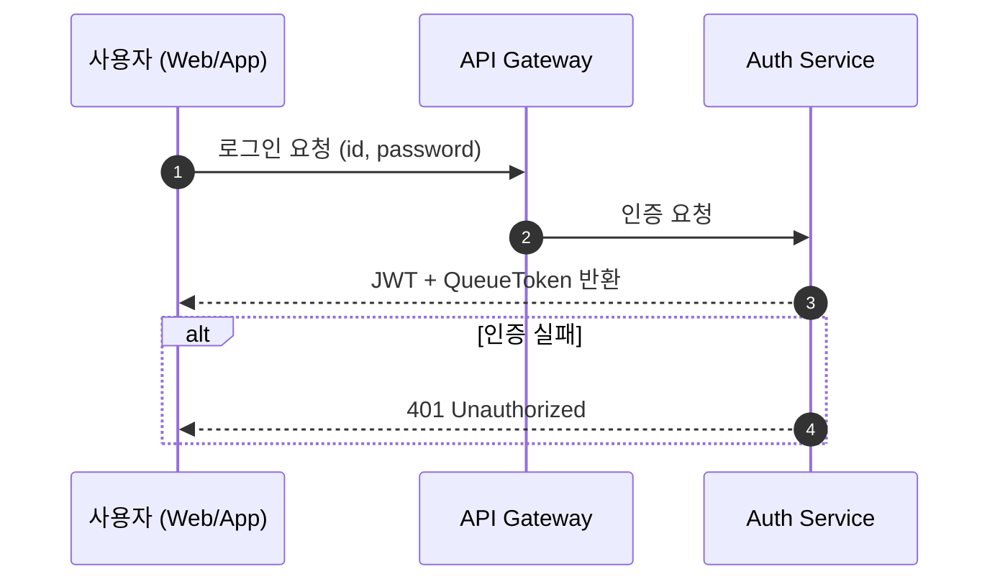
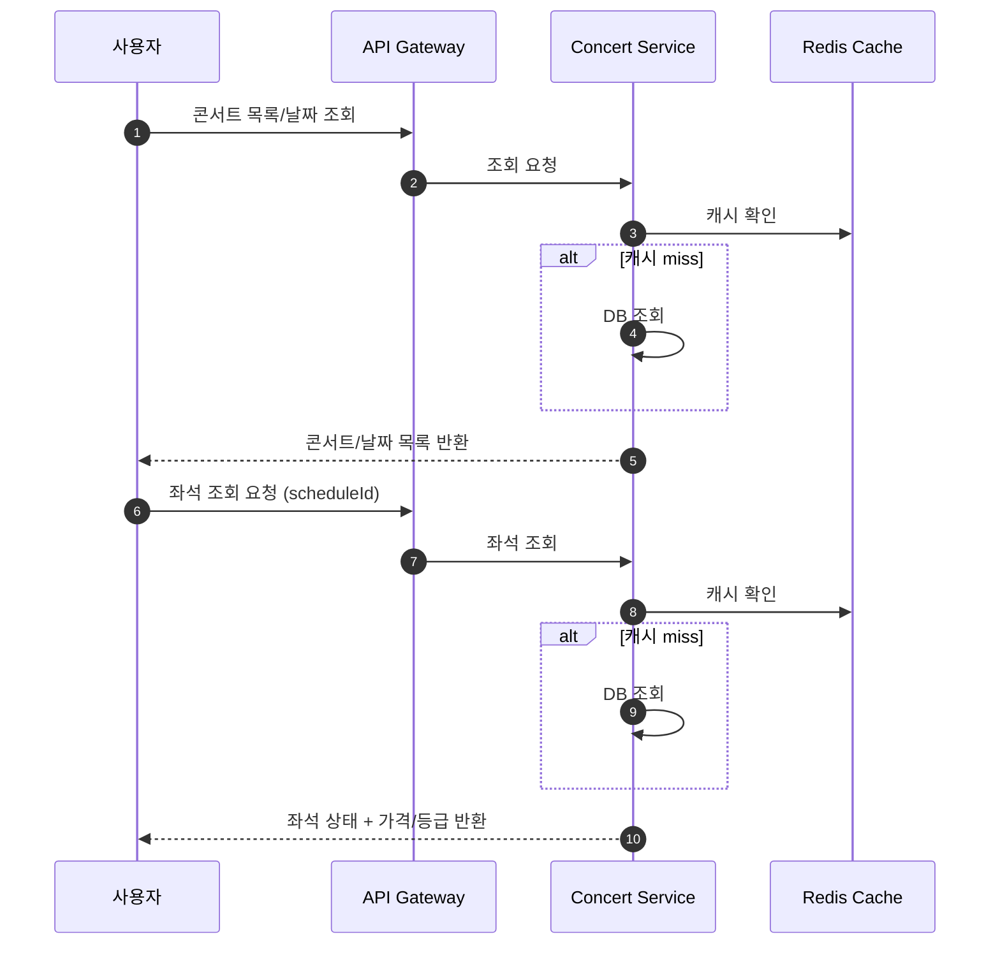
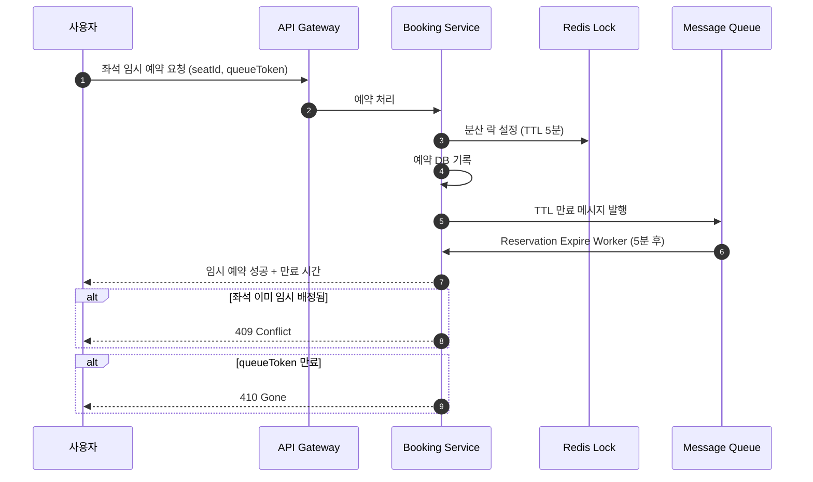
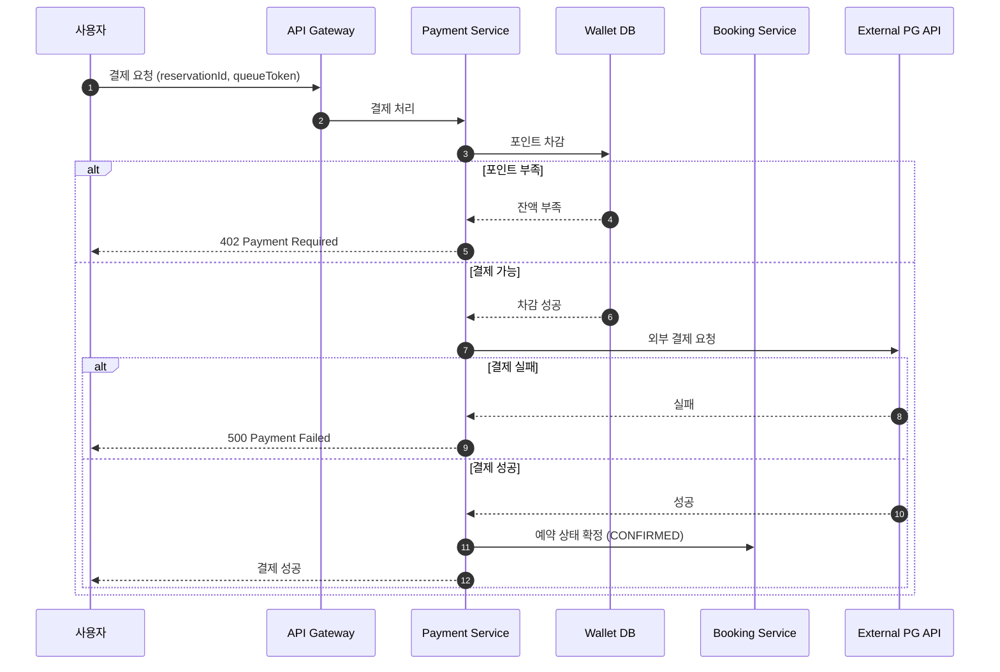

# 시퀀스 다이어그램

본 문서는 콘서트 예약 서비스의 주요 기능 흐름을 단계별 시퀀스 다이어그램으로 표현합니다.
각 단계별로 성공/예외 케이스를 포함합니다.

---

## 1. 로그인 & 인증

```mermaid
sequenceDiagram
    autonumber
    participant User as 사용자 (Web/App)
    participant APIG as API Gateway
    participant Auth as Auth Service

    User->>APIG: 로그인 요청 (id, password)
    APIG->>Auth: 인증 요청
    Auth-->>User: JWT + QueueToken 반환
    alt 인증 실패
        Auth-->>User: 401 Unauthorized
    end
```

---

## 2. 콘서트 & 좌석 조회

```mermaid
sequenceDiagram
    autonumber
    participant User as 사용자
    participant APIG as API Gateway
    participant Concert as Concert Service
    participant Redis as Redis Cache

    User->>APIG: 콘서트 목록/날짜 조회
    APIG->>Concert: 조회 요청
    Concert->>Redis: 캐시 확인
    alt 캐시 miss
        Concert->>Concert: DB 조회
    end
    Concert-->>User: 콘서트/날짜 목록 반환

    User->>APIG: 좌석 조회 요청 (scheduleId)
    APIG->>Concert: 좌석 조회
    Concert->>Redis: 캐시 확인
    alt 캐시 miss
        Concert->>Concert: DB 조회
    end
    Concert-->>User: 좌석 상태 + 가격/등급 반환
```
---

## 3. 좌석 임시 예약 (TTL 5분)

```mermaid
sequenceDiagram
    autonumber
    participant User as 사용자
    participant APIG as API Gateway
    participant Booking as Booking Service
    participant Redis as Redis Lock
    participant MQ as Message Queue

    User->>APIG: 좌석 임시 예약 요청 (seatId, queueToken)
    APIG->>Booking: 예약 처리
    Booking->>Redis: 분산 락 설정 (TTL 5분)
    Booking->>Booking: 예약 DB 기록
    Booking->>MQ: TTL 만료 메시지 발행
    MQ->>Booking: Reservation Expire Worker (5분 후)
    Booking-->>User: 임시 예약 성공 + 만료 시간
    alt 좌석 이미 임시 배정됨
        Booking-->>User: 409 Conflict
    end
    alt queueToken 만료
        Booking-->>User: 410 Gone
    end
```

## 4. 결제 및 확정

```mermaid
sequenceDiagram
    autonumber
    participant User as 사용자
    participant APIG as API Gateway
    participant Payment as Payment Service
    participant Wallet as Wallet DB
    participant Booking as Booking Service
    participant PG as External PG API

    User->>APIG: 결제 요청 (reservationId, queueToken)
    APIG->>Payment: 결제 처리
    Payment->>Wallet: 포인트 차감
    alt 포인트 부족
        Wallet-->>Payment: 잔액 부족
        Payment-->>User: 402 Payment Required
    else 결제 가능
        Wallet-->>Payment: 차감 성공
        Payment->>PG: 외부 결제 요청
        alt 결제 실패
            PG-->>Payment: 실패
            Payment-->>User: 500 Payment Failed
        else 결제 성공
            PG-->>Payment: 성공
            Payment->>Booking: 예약 상태 확정 (CONFIRMED)
            Payment-->>User: 결제 성공
        end
    end
```
