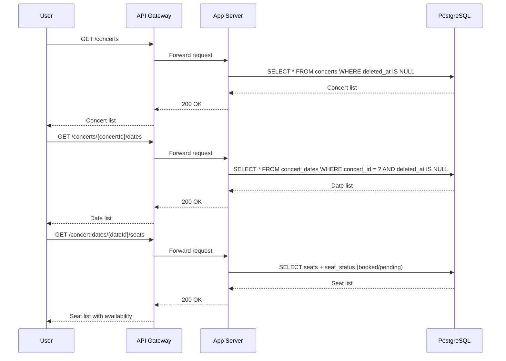
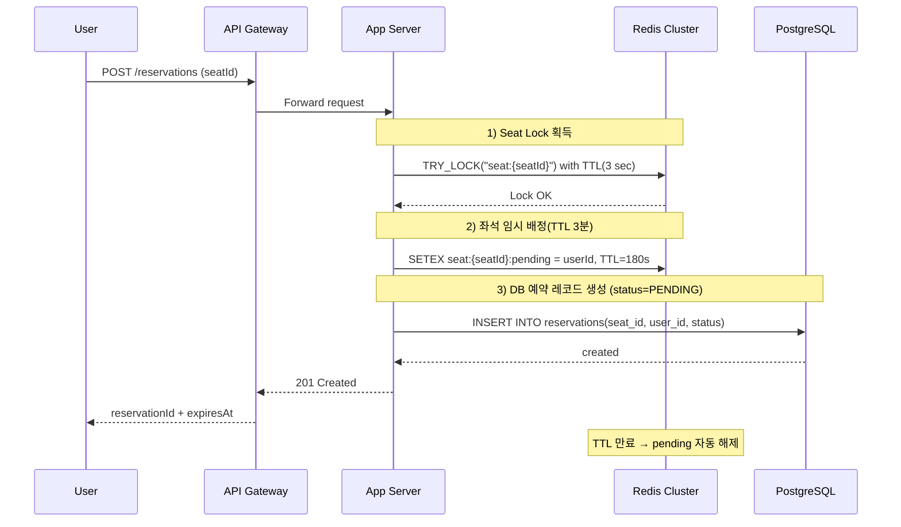
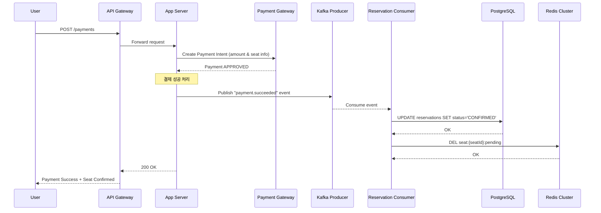
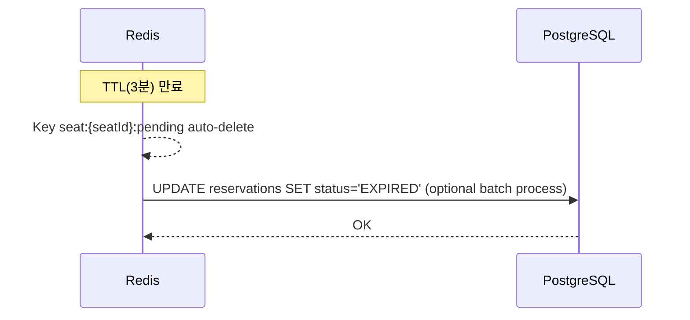
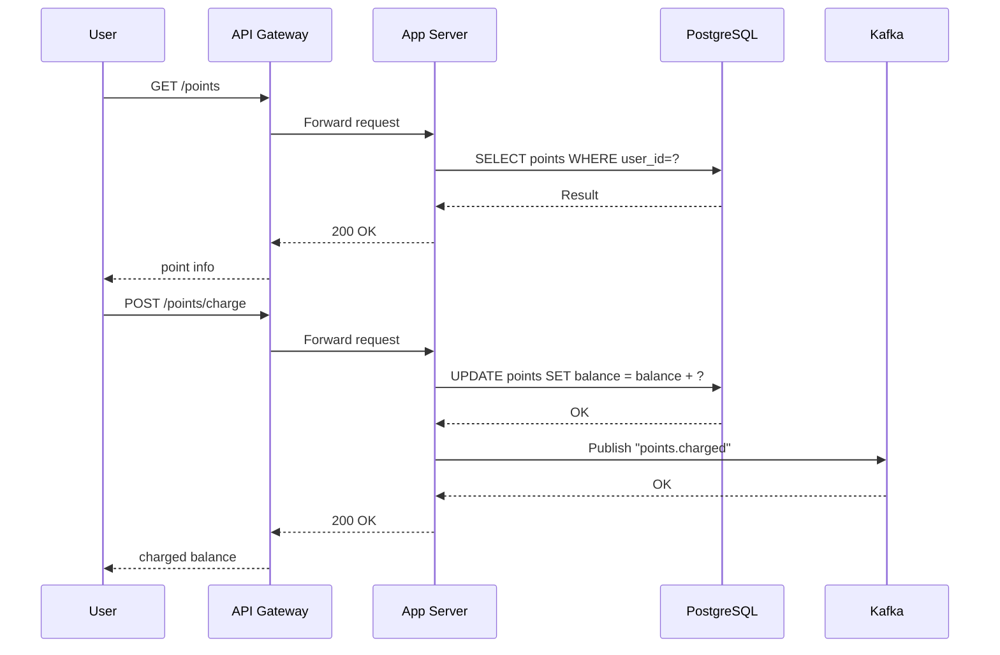
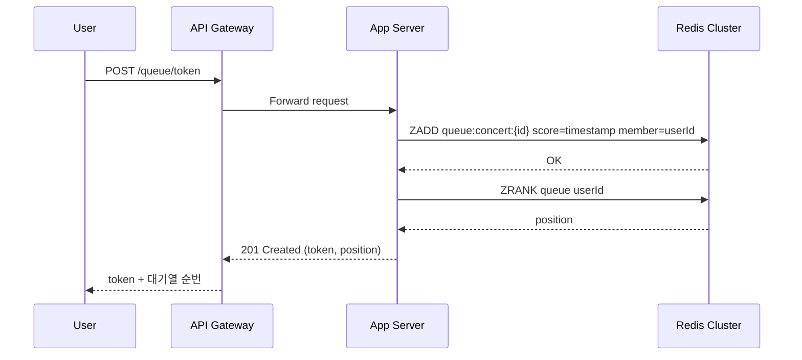
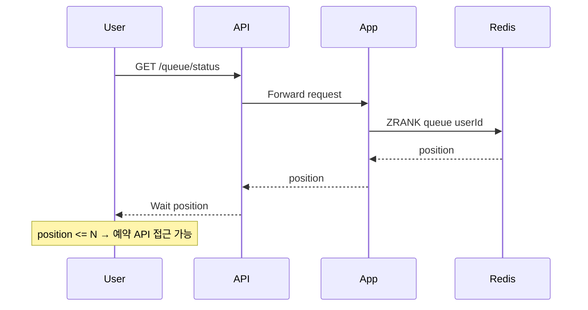
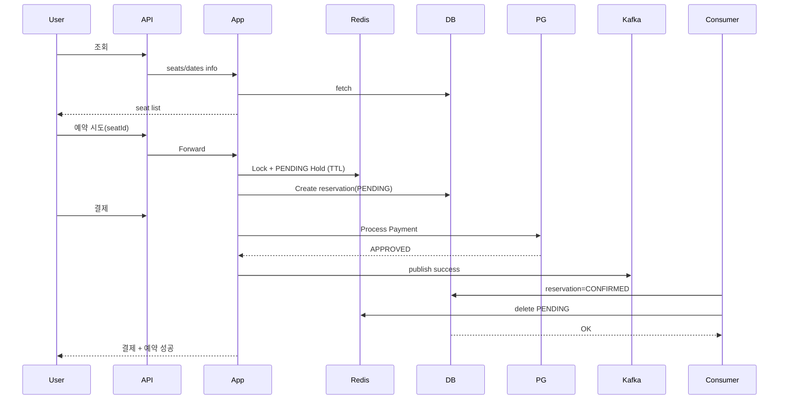

---

# 1. Overview

콘서트 예약 시스템의 핵심 비즈니스 플로우를 시퀀스 다이어그램으로 정리합니다.

---

# 2. 콘서트 조회 (콘서트 목록 → 날짜 → 좌석)

---

# 3. 좌석 예약 요청 (임시 배정: PENDING)

좌석 충돌 방지를 위해 **Redis 분산락 + Redis PENDING Hold + DB Unique(seatId) 체크**를 함께 사용합니다.

---

# 4. 결제 요청 → 승인 → 예약 확정

결제는 **외부 PG**와 연동되며,
결제 성공 후 **Kafka에 이벤트를 발행**하고
Consumer가 Reservation 상태를 **CONFIRMED**로 업데이트합니다.

---

# 5. 예약 실패 / 좌석 만료 흐름

임시 배정 후 **3분 내 결제 실패 / 만료** 시 자리 자동 해제.

---

# 6. 포인트 충전 / 조회 API

---

# 7. 대기열 토큰 발급

대기열은 Redis Sorted Set 사용
(score = timestamp)
TTL 자동 만료 적용.

---

# 8. 대기열 진입 후 실제 예약 API 호출

대기열이 0에 가까워지면 티켓 구매 API 접근 허용.

---

# 9. 예약 전체 통합 플로우 (요약 종합 버전)

---
